## Part 1. Готовый докер

1. Беру официальный докер-образ с nginx и качаю его при помощи ``docker pull```

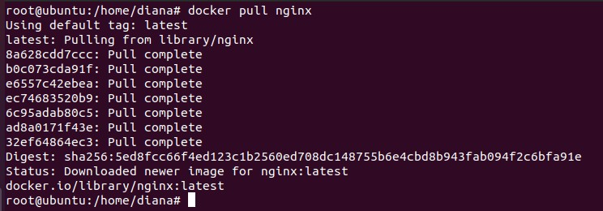

2. Проверяю наличие докер-образа через ```docker images```

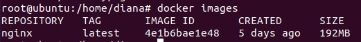

3. Запускаю докер-образ через ```docker run -d [image_id|repository]```

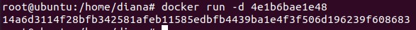

4. Проверяю, что образ запустился через ```docker ps```

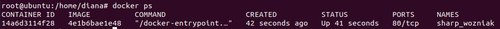

5. Смотрю информацию о контейнере через ```docker inspect [container_id|container_name]```

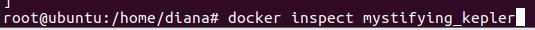

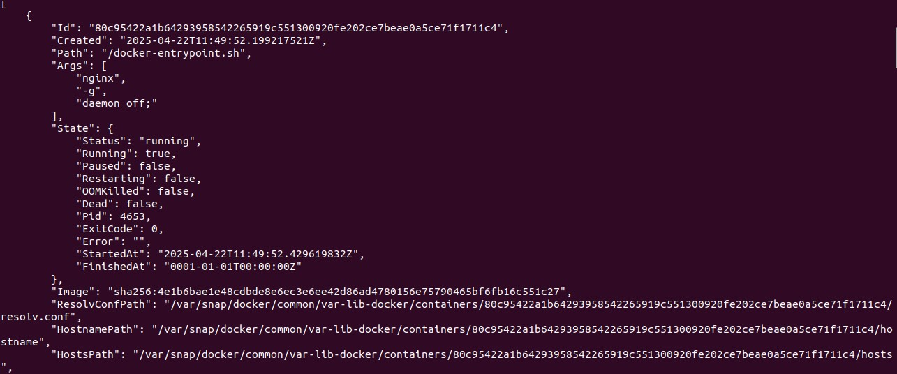


   размер контейнера:
   
   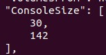
   
   список замапленных портов:
   
   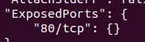
   
   ip контейнера:
   
   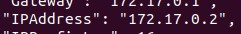
   
 6. Останавливаю докер контейнер через ```docker stop [container_id|container_name]``` и проверяю через ```docker ps```


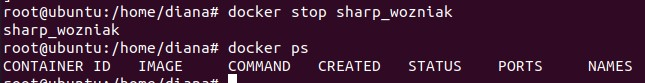

7. Запускаю докер с портами 80 и 443 командой ```docker run -p 80:80 -p 443:443 nginx```

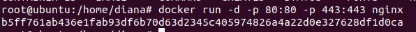

8. В браузере ввожу ```localhost:80```. Появляется стартовая страница nginx

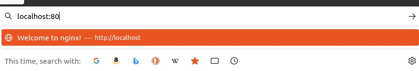

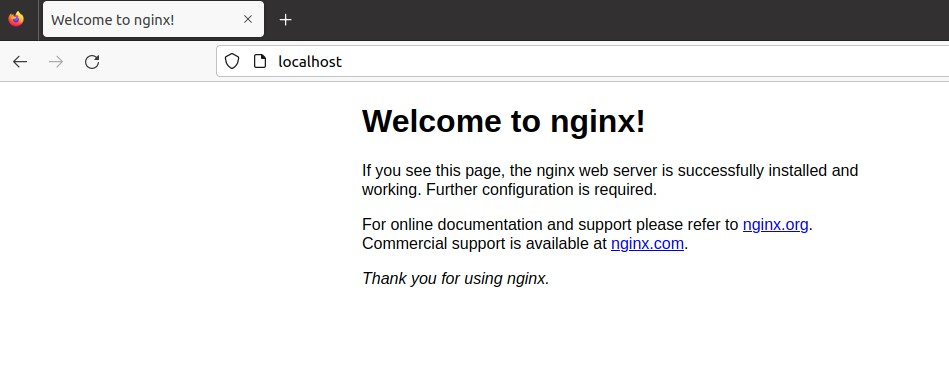

9. Перезапускаю докер ```docker restart``` и проверяю его состояние

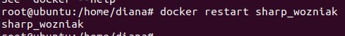

## Part 2. Операции с контейнером


1. Вывожу содержимое файла конфигурации в контейнере ```docker exec nostalgic_perlman cat /etc/nginx/nginx.conf```

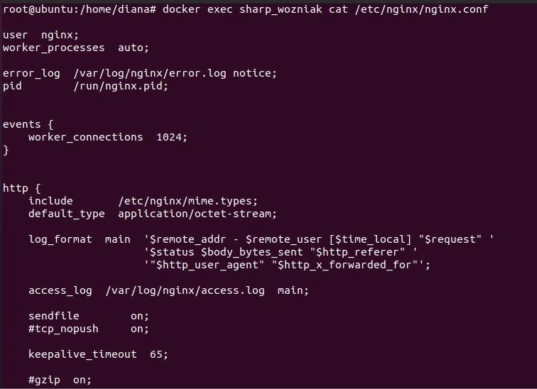

2. Создаю на машине файл nginx.conf и добавляю туда по пути /status отдачу страницы статуса сервера nginx

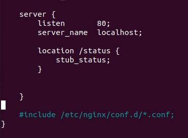

3. Копирую файл в докер ```docker cp nginx.conf nostalgic_perlman:/etc/nginx/```

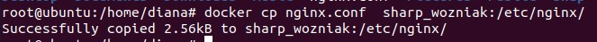

4. Перезапускаю nginx

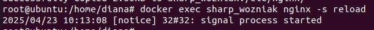

5. Командой ```docker exec -it mystifying_kepler curl http://localhost/status``` проверяю статус nginx

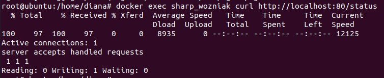

6. Эскпортирую контейнер

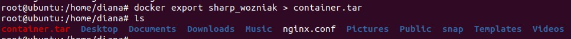

7. Останавливаю его

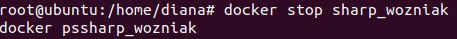

8. Сначала удаляю образ 

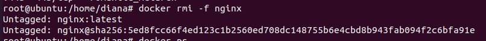

9. Затем удаляю контейнер


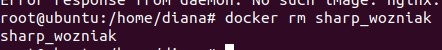

10. Импортирую сохраненный контейнер


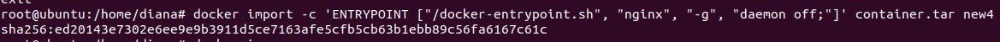

11. Проверяю контейнер через ```docker images```


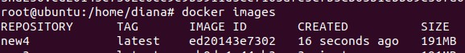

12. Запускаю контейнер 

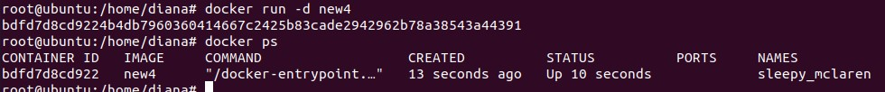

13. Проверяю статус nginx через curl

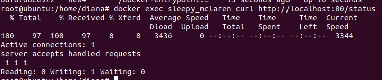

## Part 3. Мини веб-сервер

1. Создаю файл server.c, который будет выводить Hello, World!

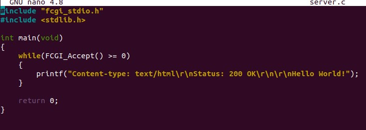

2. Запускаю докер

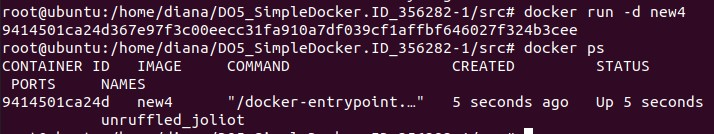

3. Компилирую server.c и копирую на докер 

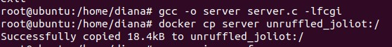

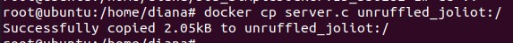

4. Изменяю nginx.conf, чтобы он проксировал все запросы с 81 порта на 127.0.0.1:8080


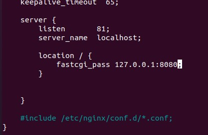

5. Копирую nginx.conf на докер

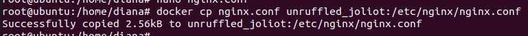

6. Захожу в докер


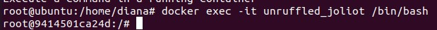

7. Качаю нужные пакеты

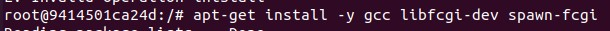

8. Перезапускаю nginx

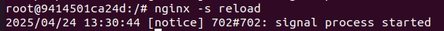

9. Запускаю сервер на порту 8080 

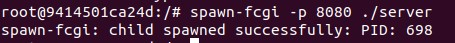

10. Прохожу по адресу ```http://localhost:81```

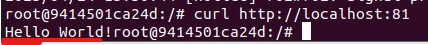


## Part 4. Свой докер

1. Устанавливаю нужные пакеты

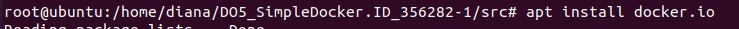

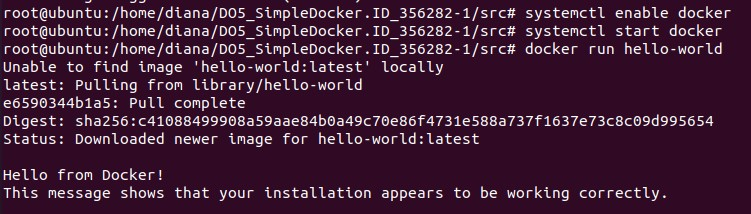

2. Создаю Dockerfile

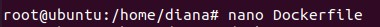

3. Редактирую, добавляю в него строки, которые:
	1. указывают рабочую директорию
	2. копируют из директории файл конфигурации nginx.conf
	3. купируют скрипт мини-сервера из части 3
	4. устанавливают нужные пакеты


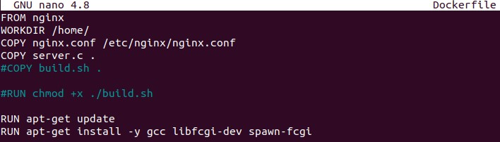


6. Создаю скрипт build.sh, который будет компилировать server.c и запускать сервер на порту 8080

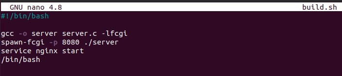

7. Добавляю entrypoint с написанным скриптом в Dockerfile и строки которые будут копировать build.sh и делать его исполняемым

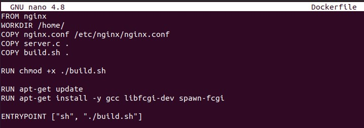

8. Монтирую образ с именем etsyhone и тегом b

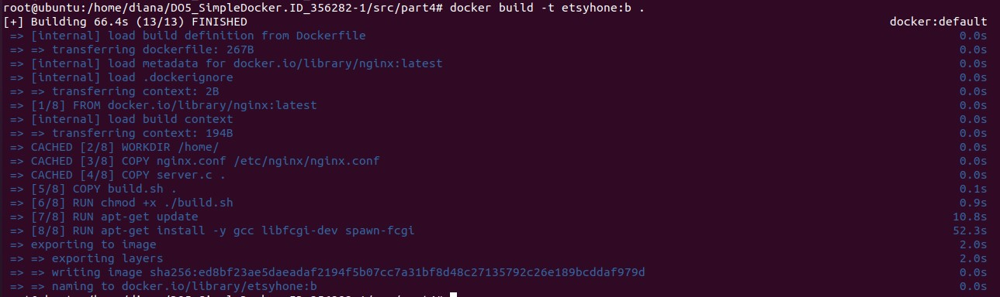


9. Проверяю, что все прошло успешно


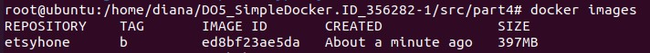

10. Запускаю образ с маппингом с 81 на 80 порт и маппингом файла конфигурации nginx внутри контейнера и проверяю работу с помощью ```docker ps```

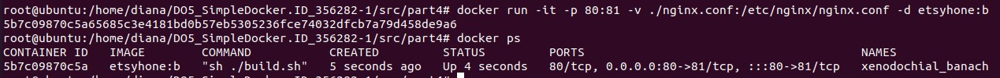

11. Проверяю через curl страницу ```localhost:80```

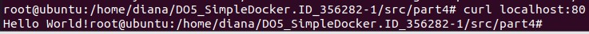

12. Добавляю в nginx.conf проксирование страницы ```status```, которая будет отображать статус nginx

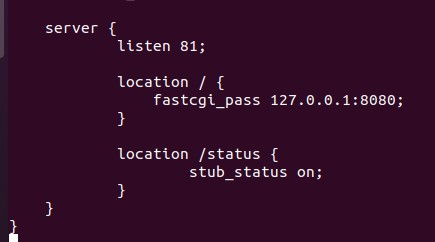

13. Останавливаю контейнер

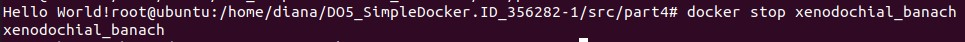

14. Пересобираю его


15. Запускаю с маппингом с 81 на 80 порт и маппингом файла конфигурации nginx и проверяю через ```docker ps```


16. С помощью curl вывожу содержимое страницы ```localhost:80/status```


## Part 5. Dockle

1. Устанавливаю Dockle строкой:

``` 
VERSION=$(
 curl --silent "https://api.github.com/repos/goodwithtech/dockle/releases/latest" | \
 grep '"tag_name":' | \
 sed -E 's/.*"v([^"]+)".*/\1/' \
) && curl -L -o dockle.deb https://github.com/goodwithtech/dockle/releases/download/v${VERSION}/dockle_${VERSION}_Linux-64bit.deb
$ sudo dpkg -i dockle.deb && rm dockle.deb
```

2. Проверяю свой докер и вижу ошибки


3. Исправляю докерфайл, добавляю строку удаления кэшированных файлов после установки, создаю и перехожу на нового пользователя


4. Запускаю докер


5. Проверяю с помощью Dockle. Остается только одна ошибка, связанная со специфичными ключами шифрования, хранящимися в образе, на основе которого мы создавали свой
 
 
 
 
 
 6. Чтобы программа не ругалась на ключи, нужно ввести 
 
``` 
DOCKLE_ACCEPT_KEYS=NGINX_GPGKEYS,NGINX_GPGKEYS,NGINX_GPGKEY_PATH dockle -d etsyhone:b
```

 
 
 ## Part 6. Базовый Docker Compose
 
 1. Создаю docker-compose.yml, который будет поднимать образ в текущей папке и второй образ из nginx. Добавляю строчку, при которой запросы, поступающие на хост по адресу localhost:80, перенаправляются на второй контейнер по порту 8080. Копирую содержимое nginx.conf на второй образ
 
  

2. Изменяю nginx.conf, чтобы проксировать все запросы с 8080 порта на 81 порт первого контейнера

  
  
  3. Проверяю и останавливаю все запущенные докеры

  
  
  4. Собираю докер (```docker compose build``` ```docker compose up```). ```docker compose up``` транслирует все процессы при сборке. флаг -d делает сборку тихой

  
  
  
  
  
  
  
  
  5. Ввожу ```curl localhost:80```.  Выходит Hello World!
 
   
